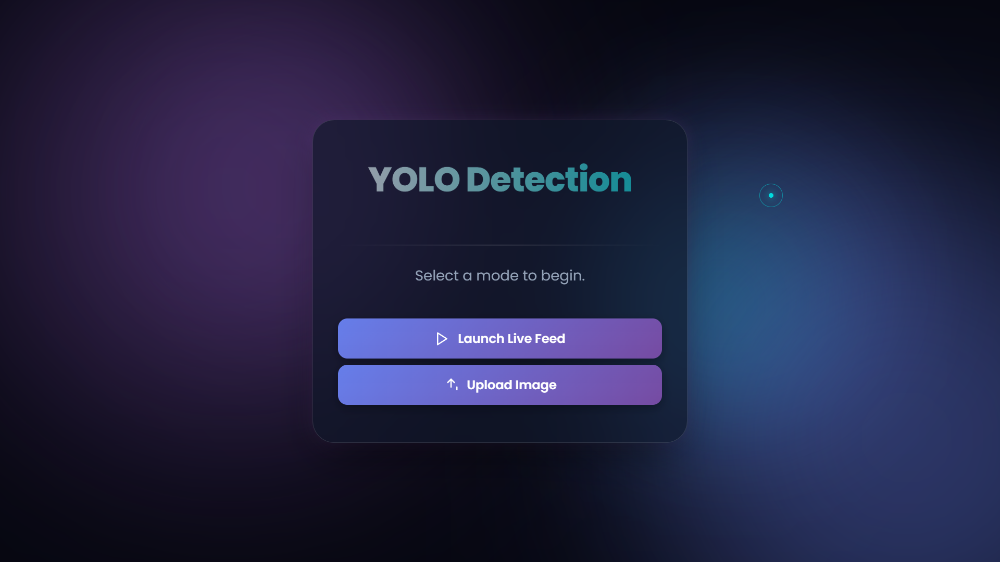
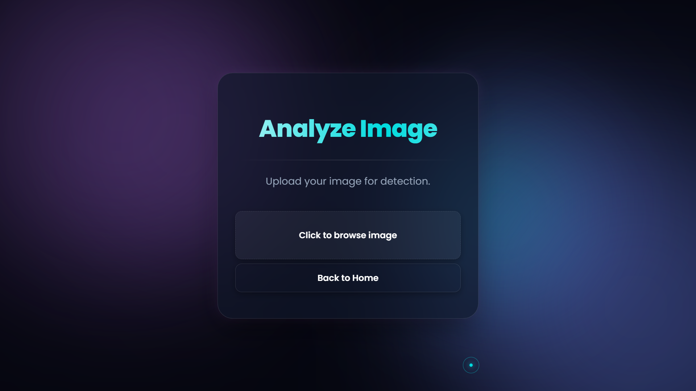

# 🤟 Sign Language Detection

> Real-time sign language detection using YOLO, OpenCV, and Flask.

A computer vision application that detects and recognizes common sign-language gestures using a trained YOLO model. The application provides a web interface for image-based and real-time webcam detection.

---

## 🚀 Overview

This project uses a trained YOLO object detection model to recognize sign-language gestures through a Flask web application.

The system is designed to demonstrate how deep learning and computer vision can be combined with a web interface to create an accessible real-time sign-language detection application.

### Supported Signs

| Gesture | Class |
|---|---|
| 👋 | Hello |
| ❤️ | I Love You |
| ❌ | No |
| 🙏 | Thanks |
| 👍 | Yes |

---

## ✨ Features

- 🤖 YOLO-based sign-language detection
- 📷 Image upload interface
- 🎥 Real-time webcam detection
- 🌐 Flask web application
- 🧠 Deep-learning-based object detection
- 📊 Confidence-based predictions
- ⚡ Real-time computer vision processing
- 🎨 Clean and responsive user interface

---

## 📸 Application Preview

### 🏠 Home Page



### 📤 Image Upload



---

## 🛠️ Tech Stack

### Programming Language

- Python

### Machine Learning

- YOLO
- Ultralytics

### Computer Vision

- OpenCV
- NumPy

### Web Development

- Flask
- HTML
- CSS

### Tools

- Git
- GitHub
- Antigravity

---

## 🧠 How It Works

```text
                    👤 User
                       │
             ┌─────────┴─────────┐
             │                   │
        📷 Image Upload      🎥 Webcam
             │                   │
             └─────────┬─────────┘
                       ↓
                🌐 Flask App
                       ↓
                🤖 YOLO Model
                       ↓
              🧠 Sign Detection
                       ↓
                📊 Prediction